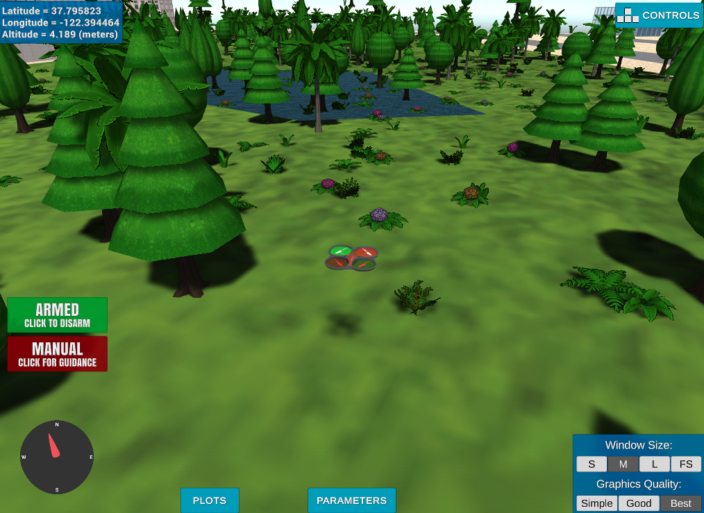

## Project: 3D Motion Planning


---


# Required Steps for a Passing Submission:
1. Load the 2.5D map in the colliders.csv file describing the environment.
2. Discretize the environment into a grid or graph representation.
3. Define the start and goal locations.
4. Perform a search using A* or other search algorithm.
5. Use a collinearity test or ray tracing method (like Bresenham) to remove unnecessary waypoints.
6. Return waypoints in local ECEF coordinates (format for `self.all_waypoints` is [N, E, altitude, heading], where the drone’s start location corresponds to [0, 0, 0, 0].
7. Write it up.
8. Congratulations!  Your Done!

## [Rubric](https://review.udacity.com/#!/rubrics/1534/view) Points
### Here I will consider the rubric points individually and describe how I addressed each point in my implementation.  

---
### Writeup / README

#### 1. Provide a Writeup / README that includes all the rubric points and how you addressed each one.  You can submit your writeup as markdown or pdf.  

You're reading it! Below I describe how I addressed each rubric point and where in my code each point is handled.

### Explain the Starter Code

#### 1. Explain the functionality of what's provided in `motion_planning.py` and `planning_utils.py`
The `motion_planning.py` script includes the `plan_path()` function, which allows the drone to set a target altitude and safety distance to navigate around obstacles in its environment.

On the other hand, `planning_utils.py` contains several key functions: 

- **`create_grid()`**: Returns the minimum north and east coordinates for the grid.
- **`valid_actions()`**: Identifies permissible actions based on grid coordinates and environmental obstacles.
- **`a_star()`**: Implements the A* search algorithm.
- **`heuristic()`**: Generates a numpy array that considers both the current and target positions.
- **`read_home()`**: Reads the drone's position from an input file, providing its latitude and longitude coordinates.
- **`collinearity_prune()`**: Prunes path points using collinearity and returns the refined path.

A notable difference between `backyard_flyer.py` and `motion_planning.py` lies in the state transition order; `motion_planning.py` includes additional PLANNING and TAKEOFF states that are not present in `backyard_flyer.py`.

In terms of testing and implementation, both `motion_planning.py` and `backyard_flyer_solution.py` feature similar methods overall. However, `motion_planning.py` has two distinct functions: `send_waypoints()` and `plan_path()`.

Regarding performance, executing `backyard_flyer_solution.py` results in the drone generating a square flight path, whereas running `motion_planning.py` causes the drone to take off, encounter obstacles, and ultimately land back at its starting position.


### Implementing Your Path Planning Algorithm

#### 1. Set your global home position
Here students should read the first line of the csv file, extract lat0 and lon0 as floating point values and use the self.set_home_position() method to set global home. Explain briefly how you accomplished this in your code.

- Below is the first line from the CSV file for `lat0` and `lon0`:


The values were obtained using the `genfromtxt()` function by providing the location of the CSV file as input, which was later used in the `set_home_position()` function.

(See `motion_planning.py`, LOC 123 - 136)


And here is a lovely picture of our downtown San Francisco environment from above!


#### 2. Set your current local position
Here as long as you successfully determine your local position relative to global home you'll be all set. Explain briefly how you accomplished this in your code.

- The current local position is as follows:

  ```python
  def local_position_callback(self):
      if self.flight_state == States.TAKEOFF:
          if -1.0 * self.local_position[2] > 0.95 * self.target_position[2]:
              self.waypoint_transition()
      elif self.flight_state == States.WAYPOINT:
          if np.linalg.norm(self.target_position[0:2] - self.local_position[0:2]) < 1.0:
              if len(self.waypoints) > 0:
                  self.waypoint_transition()
              else:
                  if np.linalg.norm(self.local_velocity[0:2]) < 1.0:
                      self.landing_transition()

(See `motion_planning.py`, LOC 44 - 54)

Meanwhile, here's a picture of me flying through the trees!


#### 3. Set grid start position from local position
This is another step in adding flexibility to the start location. As long as it works you're good to go!
- The piece of code that converts the start position using `global_to_local` is as follows:

  ```python
    local_position = global_to_local(global_position, self.global_home)
    
    print('global home {0}, position {1}, local position {2}'.format(
        self.global_home,
        self.global_position,
        self.local_position)
    )

- The grid is then set up based on the list that specifies the coordinates for the local positions.

  ```python
        grid, north_offset, east_offset = create_grid(data, TARGET_ALTITUDE, SAFETY_DISTANCE)
        print("North offset = {0}, east offset = {1}".format(north_offset, east_offset))

(See `motion_planning.py`, LOC 138 - 158)

#### 4. Set grid goal position from geodetic coords
This step is to add flexibility to the desired goal location. Should be able to choose any (lat, lon) within the map and have it rendered to a goal location on the grid.

- The following are the target coordinates for longitude, latitude, and altitude, used to render the map:

  ```python
        # Adapt to set goal as latitude / longitude position and convert
        lon_goal = -122.400511  # It can be changed to another lon goal, ex: -122.401300
        lat_goal = 37.792582  # It can be changed to another lat goal, ex: 37.796750
        alt_goal = TARGET_ALTITUDE # Default alt, it is 5
- The geodetic coordinates will represent the desired global position through the use of the global_to_local conversion.

  ```python
        global_goal = [
            lon_goal,
            lat_goal, 
            alt_goal
        ]
        local_goal = global_to_local(global_goal, self.global_home)
        grid_goal = (
            int(local_goal[0]) - north_offset,
            int(local_goal[1]) - east_offset
        )

(See `motion_planning.py`, LOC 171 - 184)


#### 5. Modify A* to include diagonal motion (or replace A* altogether)
Minimal requirement here is to modify the code in planning_utils() to update the A* implementation to include diagonal motions on the grid that have a cost of sqrt(2), but more creative solutions are welcome. Explain the code you used to accomplish this step.

- The A* algorithm was modified by using `sqrt(2)` from the math library as the cost to approximate diagonal movements of the drone. This was achieved by defining tuples in the `Action` class, where each tuple contains two action values relative to the current grid position, along with a third value representing the action’s cost. All these elements are encapsulated within the tuples.

  ```python
        # Assume all action cost are the same.
        class Action(Enum):
            """
            An action is represented by a 3 element tuple.

            The first 2 values are the delta of the action relative
            to the current grid position. The third and final value
            is the cost of performing the action.
            """

            WEST = (0, -1, 1)
            EAST = (0, 1, 1)
            NORTH = (-1, 0, 1)
            SOUTH = (1, 0, 1)
            SOUTH_EAST = (1, 1, np.sqrt(2))
            NORTH_EAST = (-1, 1, np.sqrt(2))
            SOUTH_WEST = (1, -1, np.sqrt(2))
            NORTH_WEST = (-1, -1, np.sqrt(2))

            @property
            def cost(self):
                return self.value[2]

            @property
            def delta(self):
                return (self.value[0], self.value[1])

Reference file `planning_utils.py`, LOC 46 - 71

#### 6. Cull waypoints 
For this step you can use a collinearity test or ray tracing method like Bresenham. The idea is simply to prune your path of unnecessary waypoints. Explain the code you used to accomplish this step.

- The `prune_path(self, path)` method utilizes two additional functions: `to_homogeneous` and `are_points_collinear`. These functions return an array containing the action point and the associated cost. The `are_points_collinear` function evaluates three points, returning a tuple `(p1, p2, p3, 0)` after comparing the absolute value of the linearized determinant with the given epsilon value.

- In each iteration, the first function generates three new points for the next cycle. The second function checks if the points are collinear based on the determinant; if they are, the next point is ignored. If the points are not collinear, an intermediate point is added to the path.

Reference file `motion_planning.py`, LOC 202 - 274

### Execute the flight
#### 1. Does it work?
It works!

### Double check that you've met specifications for each of the [rubric](https://review.udacity.com/#!/rubrics/1534/view) points.

Checked.
  
# Extra Challenges: Real World Planning

For an extra challenge, consider implementing some of the techniques described in the "Real World Planning" lesson. You could try implementing a vehicle model to take dynamic constraints into account, or implement a replanning method to invoke if you get off course or encounter unexpected obstacles.

Project completed.